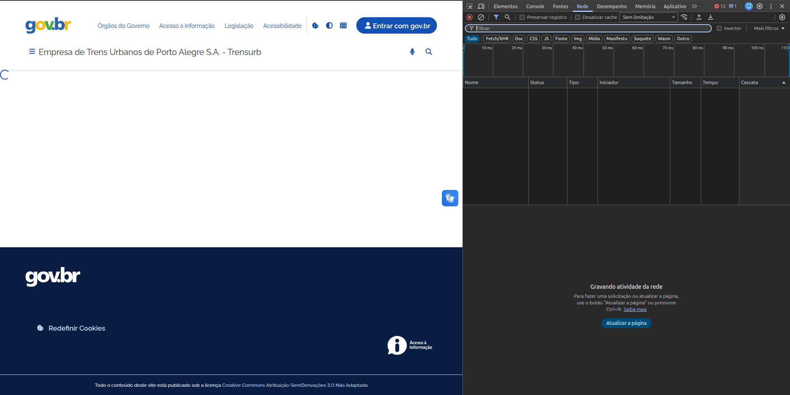
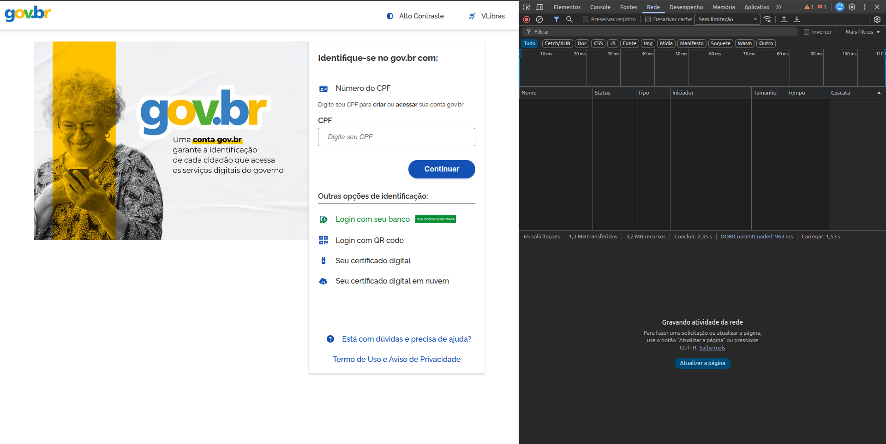
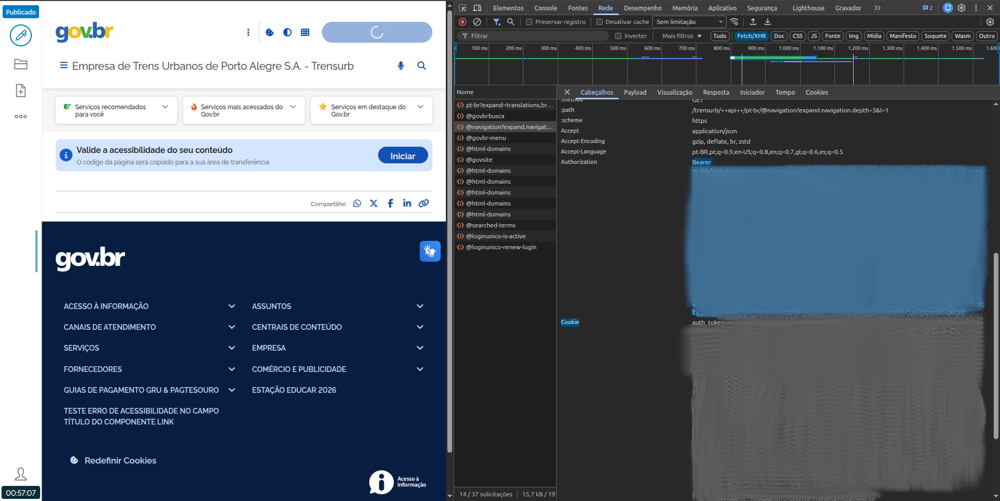

# Migração de Notícias para Plone 6 via REST API (JWT)

> Manual de Uso v.0

Autor: [Byron Lanverly](https://github.com/lanverly)

## 1. Objetivo

Este documento descreve a estratégia para migração de notícias de um sistema legado para Plone 6, utilizando:

- Plone REST API (plone.restapi)
- Autenticação via JWT
- Frontend moderno baseado em Volto (React)

A abordagem prioriza:

- segurança (token-based);
- escalabilidade (API-driven);
- compatibilidade futura com Volto;
- automação (script de migração).

📌 Documentação oficial da API:
https://6.docs.plone.org/plone.restapi/docs/source/

O fluxo cobre:

- autenticação via token;
- criação de estrutura;
- ingestão de notícias;
- publicação via workflow;
- validação;
- geração de relatório.

## 2. Arquitetura da solução

A migração está inserida em uma arquitetura desacoplada (headless CMS):

```
[ Sistema Legado ]
        ↓
[ Script de Migração ]
        ↓
[ Plone 6 (REST API + JWT) ]
        ↓
[ Volto (Frontend React)]
```

Papel de cada componente

| Componente | Função |
| - | - |
| REST API | Interface de ingestão e gestão de conteúdo |
| JWT | Controle de autenticação para automações |
| Plone | Backend CMS |
| Volto | Camada de apresentação (headless frontend) |

## 3. Estratégia de Migração

A migração segue um pipeline determinístico:

- autenticação via JWT;
- preparação do ambiente (estrutura e permissões);
- ingestão de conteúdo (News Item);
- publicação via workflow;
- validação via busca;
- geração de relatório.

Essa abordagem utiliza os endpoints principais da API:

- @login → autenticação
- POST /container → criação
- PATCH /objeto → atualização
- @workflow → publicação
- @search → validação

Referência:
https://6.docs.plone.org/plone.restapi/docs/source/usage/content.html

## 4. Autenticação (JWT)

### Modelo adotado
- autenticação baseada em token (stateless)
- renovação automática
- isolamento de credenciais

#### Fluxo
```
POST /@login → token JWT
↓
Authorization: Bearer <token>
↓
Chamadas REST subsequentes
```

Referência:
https://6.docs.plone.org/plone.restapi/docs/source/usage/authentication.html

Benefícios

- evita uso de credenciais em múltiplas requisições;
- adequado para scripts e pipelines CI/CD;
- permite controle de sessão.

### 4.1 Obter token

1 Entrar no site destino:



2 Login com a conta GOV



3 Ir até o elemento **@navigation?expand.navigation.depth** e buscar no campo **Authorization** o valor do **Bearer Token**



Resposta:

```text
Bearer JWT_TOKEN_AQUI
```

### 4.2 Uso do token

Todas as requisições devem incluir:

```bash
-H "Authorization: Bearer JWT_TOKEN_AQUI"
```

### 4.3 Renovação de token

```bash
curl -X POST "https://seu-plone.exemplo/@login-renew" \
  -H "Authorization: Bearer JWT_TOKEN_AQUI"
```

## 5. Fluxo de migração

1. autenticar (`/@login`)
2. validar conexão
3. garantir pasta `/noticias`
4. iterar registros da base
5. normalizar dados
6. criar ou atualizar notícia
7. publicar via workflow
8. validar via busca
9. gerar relatório

## 6. Estrutura do JSON de entrada

```json
[
  {
    "id": "edital-2026",
    "title": "Edital 2026 publicado",
    "description": "Resumo da notícia",
    "text_html": "<p>Conteúdo HTML</p>",
    "subjects": ["edital", "2026"]
  }
]
```

## 7. Criação de conteúdo

### 7.1 Criar notícia

```bash
POST /noticias
```

```json
{
  "@type": "News Item",
  "id": "edital-2026",
  "title": "Edital 2026 publicado",
  "description": "Resumo",
  "text": {
    "data": "<p>Conteúdo HTML</p>",
    "content-type": "text/html",
    "encoding": "utf-8"
  },
  "subjects": ["edital"]
}
```

### 7.2 Atualização parcial

```bash
PATCH /noticias/edital-2026
```

## 8. Publicação via workflow

### 8.1 Verificar transições

```bash
GET /noticias/edital-2026/@workflow
```

### 8.2 Publicar

```bash
POST /noticias/edital-2026/@workflow/publish
```

## 9. Validação

### 9.1 Busca geral

```bash
GET /noticias/@search?SearchableText=edital*&fullobjects=1
```

### 9.2 Query estruturada

```bash
POST /@querystring-search
```

```json
{
  "query": [
    {
      "i": "portal_type",
      "o": "plone.app.querystring.operation.selection.any",
      "v": ["News Item"]
    }
  ]
}
```

## 10. Script Python (JWT)

### 10.1 Dependências

```bash
pip install requests
```

### 10.2 Script completo

```python
import requests
import json
import csv
import time
from typing import Optional

class PloneJWT:
    def __init__(self, base_url, username, password):
        self.base_url = base_url.rstrip("/")
        self.username = username
        self.password = password
        self.session = requests.Session()
        self.token = None
        self.authenticate()

    def authenticate(self):
        r = self.session.post(
            f"{self.base_url}/@login",
            json={"login": self.username, "password": self.password},
        )
        r.raise_for_status()
        self.token = r.json()["token"]
        self.session.headers["Authorization"] = f"Bearer {self.token}"
        self.session.headers["Accept"] = "application/json"
        self.session.headers["Content-Type"] = "application/json"

    def request(self, method, url, **kwargs):
        r = self.session.request(method, url, **kwargs)

        if r.status_code == 401:
            self.authenticate()
            r = self.session.request(method, url, **kwargs)

        r.raise_for_status()
        return r

    def get(self, path):
        return self.request("GET", f"{self.base_url}{path}")

    def post(self, path, payload=None):
        return self.request("POST", f"{self.base_url}{path}", json=payload)

    def patch(self, path, payload):
        return self.request("PATCH", f"{self.base_url}{path}", json=payload)

def ensure_folder(api: PloneJWT, folder_id):
    r = api.get(f"/{folder_id}")
    if r.status_code == 200:
        return

    api.post("/", {
        "@type": "Folder",
        "id": folder_id,
        "title": "Notícias"
    })

def publish(api: PloneJWT, path):
    r = api.get(f"{path}/@workflow").json()
    transitions = [t["id"] for t in r.get("transitions", [])]

    if "publish" in transitions:
        api.post(f"{path}/@workflow/publish")

def migrate(api, data):
    results = []

    for item in data:
        try:
            item_id = item.get("id") or item["title"].lower().replace(" ", "-")
            path = f"/noticias/{item_id}"

            payload = {
                "@type": "News Item",
                "id": item_id,
                "title": item["title"],
                "description": item.get("description", ""),
                "text": {
                    "data": item.get("text_html", ""),
                    "content-type": "text/html",
                    "encoding": "utf-8"
                },
                "subjects": item.get("subjects", [])
            }

            # create or update
            r = api.get(path)
            if r.status_code == 200:
                api.patch(path, payload)
                status = "updated"
            else:
                api.post("/noticias", payload)
                status = "created"

            publish(api, path)

            results.append((item_id, status, "ok"))

        except Exception as e:
            results.append((item.get("id"), "error", str(e)))

        time.sleep(0.2)

    return results

def main():
    api = PloneJWT(
        base_url="https://seu-plone.exemplo",
        username="admin",
        password="secret"
    )

    with open("news.json", encoding="utf-8") as f:
        data = json.load(f)

    ensure_folder(api, "noticias")

    results = migrate(api, data)

    with open("report.csv", "w", newline="", encoding="utf-8") as f:
        writer = csv.writer(f)
        writer.writerow(["id", "status", "result"])
        writer.writerows(results)

if __name__ == "__main__":
    main()
```

## 11. Boas práticas operacionais

### 11.1 Execução segura

- rodar primeiro em homologação
- validar 5–10 registros antes do lote completo
- monitorar logs do Plone

### 11.2 Qualidade dos dados

- sanitizar HTML
- normalizar IDs (slug)
- evitar duplicidade

### 11.3 Performance

- usar `sleep` leve (rate limit)
- processar em batches
- monitorar HTTP 429 / 401

### 11.4 Segurança

- não armazenar senha em texto plano
- usar variáveis de ambiente
- rotacionar token em execuções longas

## 12. Extensões recomendadas

Para evoluir essa migração:

- upload de imagem destacada (TUS ou field upload)
- preservação de data original (`effective`, `created`)
- criação de aliases (`@aliases`)
- mapeamento de autores (`creators`)
- conversão para blocks (Volto)

## 13. Conclusão

O uso de JWT no `plone.restapi` fornece:

- isolamento de credenciais
- maior segurança para automações
- controle de sessão para scripts longos

Para migração de notícias, o padrão mais robusto é:

- criar via `POST`
- ajustar via `PATCH`
- publicar via `@workflow`
- validar via `@search`
