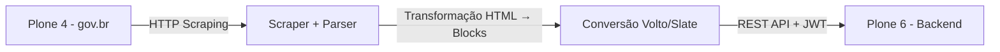

# Migração de Notícias

> WEBSITE (Plone 4 → Plone 6)

**Autor:** Byron Lanverly

## Visão Geral

Este projeto automatiza a **migração completa de notícias** do portal institucional da Trensurb **Plone 4** para uma instância moderna baseada em **Plone 6 (Volto)**.

A solução realiza:

- Scraping estruturado das notícias públicas
- Extração semântica de conteúdo (título, corpo, data, tags, imagem)
- Transformação para o modelo de **blocks (Volto/Slate)**
- Inserção via **API REST oficial do Plone 6**
- Autenticação segura via **Bearer Token (JWT)**
- Controle de progresso para execução incremental/idempotente

## Arquitetura da Solução



## Funcionalidades Principais

### Coleta de Conteúdo

- Navegação paginada automática
- Extração de:
  - Título
  - Resumo
  - Corpo HTML
  - Data de publicação
  - Imagem + legenda
  - Tags/categorias

### Transformação de Conteúdo

- Conversão de HTML → **Blocos Volto (Slate)**
- Suporte a:
  - Parágrafos
  - Cabeçalhos
  - Listas
  - Links
  - Imagens
  - Estruturas complexas (figure, table, etc.)

### Integração com Plone 6

- Uso da API REST oficial:
  - [https://6.docs.plone.org/plone.api/index.html](https://6.docs.plone.org/plone.api/index.html)
- Criação de `News Item` com:
  - Blocks estruturados
  - Metadata (tags, data, descrição)
- Publicação automática via workflow

### Robustez Operacional

- Retry automático para falhas HTTP
- Detecção de duplicidade via catalog
- Persistência de progresso (`progress_file`)
- Logging detalhado (`migracao.log`)

## Requisitos

- Python **3.9+**
- Ambiente Linux recomendado

### Dependências

```bash
pip install requests beautifulsoup4 lxml
```

## Configuração

Referência detalhada das variáveis: [CONFIG.md](/home/lanverly/Documentos/Cgplt/2026/project-migration/CONFIG.md)

Crie o arquivo `config.json` na raiz do projeto:

```json
{
  "plone_url": "https://seu-plone.exemplo.gov.br/site/pt-br",
  "plone_token": "Bearer JWT_TOKEN_AQUI",
  "plone_news_folder": "/noticias",
  "source_base": "https://www.gov.br",
  "source_start": "https://www.gov.br/orgaos/exemplo/pt-br/assuntos/noticias",
  "delay": 1,
  "all_pages": true,
  "max_news": 0,
  "progress_file": "migracao_progresso.json",
  "portal_type": "Document",
  "migrate_as_self": true,
  "skip_files": false
}
```

### Legenda das Variáveis

- `plone_url`: URL base do site Plone 6 de destino.
- `plone_token`: token JWT usado na autenticação da API. Pode ser informado com ou sem o prefixo `Bearer `, mas o exemplo já usa o formato completo.
- `plone_news_folder`: caminho da pasta ou página de destino dentro do Plone.
- `source_base`: domínio base usado para resolver links relativos da origem.
- `source_start`: URL inicial da listagem ou da página única que será migrada.
- `delay`: intervalo, em segundos, entre requisições.
- `all_pages`: se `true`, percorre paginação da origem; se `false`, processa apenas a URL inicial.
- `max_news`: limita a quantidade de links processados. Use `0` para não limitar.
- `progress_file`: arquivo local que guarda o progresso da migração.
- `portal_type`: tipo de conteúdo criado no Plone.
- `migrate_as_self`: se `true`, aplica o conteúdo diretamente na própria pasta/página de destino; se `false`, cria itens filhos dentro da pasta.
- `skip_files`: se `true`, não reenvia anexos e tenta apenas religar links para arquivos já existentes no Plone.

### Valores de `portal_type`

- `Document`: usado para migrar páginas comuns, páginas institucionais e páginas com anexos.
- `News Item`: usado para migrar notícias, com suporte a blocos específicos como lead image, social share e text-to-speech.

Hoje o app expõe apenas esses dois valores na interface e o script foi ajustado para esses dois cenários.

## Execução

```bash
# (Opcional) Ativar ambiente virtual
source .venv/bin/activate

# Executar migração
python trensurb_migrar_noticias.py
```

## Saídas e Monitoramento

### Logs

Arquivo:

```bash
migracao.log
```

Contém:

- Progresso detalhado
- Erros HTTP
- Criação de conteúdos
- Publicações

### Controle de Progresso

Arquivo:

```bash
progress.json
```

Permite:

- Retomar execuções interrompidas
- Evitar reprocessamento

## Segurança

- Autenticação via **Bearer Token (JWT)**
- Validação de conexão com Plone antes da execução
- Desativação de SSL verification **(apenas para ambientes controlados)**

## Casos de Uso

* Migração institucional Plone 4 → Plone 6
* Modernização de portais governamentais
* Consolidação de conteúdo legado
* Reestruturação de CMS com Volto

## Licença

Uso interno / institucional.
